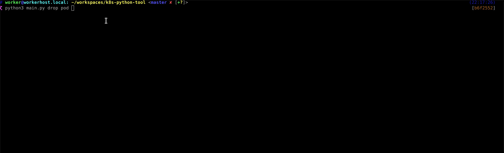

# K8S Python Tools

*NOTE: This is beta-software.* 

## General
This is a python command line tool *and* a library on top of [Official Python Kubernetes API Client](https://github.com/kubernetes-client/python) 
providing higher level API methods and a basic architecture for cli commands of common tasks in Kubernetes environments.

Each command is capable of interactive and non-interactive usage by accepting command line arguments.
Use `-h` or `--help` to see the arguments of each command.

*NOTE:* Non-interactive usage does not ask the user for confirmation! Use it wisely.

If you do not provide all required command line arguments the command is running
in interactive mode automatically and your arguments are used only if present.

This command initially supports three sub commands.  
They can also be seen as command categories: **drop**, **list**, **execute**.

### Drop
Remove/delete/kill/wipe a single Kubernetes resource. See table of supported Kubernetes Resource Objects below.

### List
List certain objects and information for certain purposes. E.g. list all Services with *cluster.local*.

### Execute
Category of commands which usually implement a sequence of user controlled actions, e.g. database migrations.
Commands of this category can be very flexible and do not necessarily need to be non-interactive.

- **`execute pod`**: Executes one or several shell commands in a remote container.

- **`execute [postgres|mariadb]-migration-dump`**: Dumps a complete PostgreSQL or MariaDB/MySQL instance in a pod to a .sql(.gz - if available)
 file and imports the data safely into another pod (could be in another cluster and namespace).
This is done via downloading the dump file to the *local file system* (to the folder you execute the command in)
 and uploading it then to the remote pod with sha256 hashes as file consistency checks.
 
- **`execute apply-tpl`**: A simple **Kubernetes yaml template renderer and runner** of `kubectl apply -f`.   
You have to provide one or several yaml files which can contain one or more yaml objects. These files are
 [jinja2 templates](http://jinja.pocoo.org/) of plain yaml files, so you can use `{{ variable }}` and all other
  valid jinja2 syntax elements in your Kubernetes yaml files.
The command will ask you for the values of the missing template variables and a name for the rendered
 template to store. E.g. if your template is called `template.yml` and you enter "dev" as *name*, the command will render
 the final content to `template-dev.yml` file in the same directory.  
A Yes-No-Dialog will then ask the user whether `kubectl apply -f` shall be executed on the recently generated yaml file.  
This command enables you to define simple but powerful yaml templates of your Kubernetes deployment definitions and 
you are able to put your environment specific stuff into variables.

- **`execute scale-deployment`** Scale replicas of a Kubernetes Deployment object resource.

# Usage

```console
$ python main.py
usage: python main.py [-h] {drop,execute,list} ...

positional arguments:
  {drop,execute,list}
    drop            drop -h
    execute         execute -h
    list            list -h

optional arguments:
  -h, --help        show this help message and exit
```

#### Drop
```console
$ python3 main.py drop
usage: python3 main.py drop [-h]
                            {pod,service,deployment,namespace,replication_controller,set,persistent_volume_claim,
                            ingress,network_policy,job,cron_job,config_map,secret,service_account,resource_quota,
                            endpoints,pod_template,role_binding,role,pod_disruption_budget,event,lease,
                            horizontal_pod_autoscaler,controller_revision,limit_range,cluster_role,cluster_role_binding,
                            pod_security_policy,persistent_volume,certificate_signing_request,volume_attachment,
                            storage_class,priority_class,node,custom_resource_definition}
                            ...

positional arguments:
  {pod,service,deployment,namespace,replication_controller,set,persistent_volume_claim,ingress,network_policy,
  job,cron_job,config_map,secret,service_account,resource_quota,endpoints,pod_template,role_binding,role,
  pod_disruption_budget,event,lease,horizontal_pod_autoscaler,controller_revision,limit_range,cluster_role,
  cluster_role_binding,pod_security_policy,persistent_volume,certificate_signing_request,volume_attachment,
  storage_class,priority_class,node,custom_resource_definition}

optional arguments:
  -h, --help            show this help message and exit
```



#### Execute
```console
$ python3 main.py execute
usage: python3 main.py execute [-h]
                               {apply-tpl,pod,mariadb-migration-dump,postgres-migration-dump,scale-deployment}
                               ...

positional arguments:
  {apply-tpl,pod,mariadb-migration-dump,postgres-migration-dump,scale-deployment}

optional arguments:
  -h, --help            show this help message and exit
```

##### execute pod
```console
$ python3 main.py execute pod -h 
usage: python3 main.py execute pod [-h] [--context CONTEXT]
                                   [--namespace NAMESPACE] [--pod POD]
```
##### execute [postgres|mariadb]-migration-dump
```console
ζ python3 main.py execute postgres-migration-dump -h
usage: python3 main.py execute postgres-migration-dump [-h]
                                                       [--context CONTEXT]
                                                       [--snamespace SNAMESPACE]
                                                       [--spod SPOD]
                                                       [--sport SPORT]
                                                       [--suser SUSER]
                                                       [--spw SPW]
                                                       [--slocation SLOCATION]
                                                       [--tcontext TCONTEXT]
                                                       [--tnamespace TNAMESPACE]
                                                       [--tpod TPOD]
                                                       [--tport TPORT]
                                                       [--tuser TUSER]
                                                       [--tpw TPW]
                                                       [--tlocation TLOCATION]

optional arguments:
  -h, --help            show this help message and exit
  --snamespace SNAMESPACE
                        source namespace
  --spod SPOD           source pod
  --sport SPORT         source postgres database port
  --suser SUSER         source postgres database user
  --spw SPW             source postgres database password
  --slocation SLOCATION
                        source postgres database dump location
  --tcontext TCONTEXT   target context
  --tnamespace TNAMESPACE
                        target namespace
  --tpod TPOD           target pod
  --tport TPORT         target postgres database port
  --tuser TUSER         target postgres database user
  --tpw TPW             target postgres database password
  --tlocation TLOCATION
                        target postgres database dump location

optional:
  --context CONTEXT, -c CONTEXT
                        prod, staging, dev ...
```

##### execute apply-tpl
```console
$ python3 main.py execute apply-tpl -h  
usage: python3 main.py execute apply-tpl [-h] [--context CONTEXT]
                                         [--path PATH]
                                         [--files FILES [FILES ...]]
                                         [--name NAME]

optional arguments:
  -h, --help            show this help message and exit
  --path PATH           an absolute template directory path
  --files FILES [FILES ...]
                        one or several space-separated relative yaml template
                        file paths
  --name NAME           a slug for the new template

optional:
  --context CONTEXT, -c CONTEXT
                        prod, staging, dev ...
```


##### execute scale-deployment
```console
$ python3 main.py execute scale-deployment -h
usage: python3 main.py execute scale-deployment [-h] [--context CONTEXT]
                                                [--namespace NAMESPACE]
                                                [--deployment DEPLOYMENT]

optional arguments:
  -h, --help            show this help message and exit

optional:
  --context CONTEXT, -c CONTEXT
                        a name of the cluster to work on
  --namespace NAMESPACE, -n NAMESPACE
                        a namespace name
  --deployment DEPLOYMENT, -d DEPLOYMENT
                        a name of a deployment
```

#### List
```console
$ python3 main.py list
usage: python3 main.py list [-h]
                            {cronjobs-by-context,ingress-by-context,pods-by-context,pvc-by-context,svc-cluster-local}
                            ...

positional arguments:
  {cronjobs-by-context,ingress-by-context,pods-by-context,pvc-by-context,svc-cluster-local}

optional arguments:
  -h, --help            show this help message and exit
```

##### list pods-by-context
```console
$ python3 main.py list pods-by-context  
Only one context minikube  - Auto-Selecting.
Loading context:  minikube
Listing pods with their IPs and owner in context: minikube
results: 21
10.1.0.2        kube-system     coredns-fb8b8dccf-7lspl ReplicaSet(coredns-fb8b8dccf)
10.1.0.4        kube-system     coredns-fb8b8dccf-rhcdl ReplicaSet(coredns-fb8b8dccf)
10.0.2.15       kube-system     etcd-minikube
...
```

##### list pvc-by-context
##### list ingress-by-context
##### list cronjobs-by-context
##### list svc-cluster-local


### Supported Kubernetes objects

| name/kind | object name | API | Namespaced |
|---|---|---|---|
| Deployment | deployment | ExtensionsV1beta1Api | yes |
| Namespace | namespace | CoreV1Api | no |
| Pod | pod | CoreV1Api | yes |
| Service | service | CoreV1Api | yes |
| Set (=ReplicaSet, DaemonSet, StatefulSet) | replica_set/daemon_set/stateful_set | CoreV1Api | yes |
| PersistentVolumeClaim | persistent_volume_claim | CoreV1Api | yes |
| Ingress | ingress | ExtensionsV1beta1Api | yes |
| NetworkPolicy | network_policy | ExtensionsV1beta1Api | yes |
| Job | job | BatchV1Api | yes |
| CronJob | cron_job | BatchV1beta1Api | yes |
| ConfigMap | config_map | CoreV1Api | yes |
| Secret | secret | CoreV1Api | yes |
| ServiceAccount | service_account | CoreV1Api | yes |
| ResourceQuota | resource_quota | CoreV1Api | yes |
| Endpoints | endpoints | CoreV1Api | yes |
| PodTemplate | pod_template | CoreV1Api | yes |
| RoleBinding | role_binding | RbacAuthorizationV1Api | yes |
| Role | role | RbacAuthorizationV1Api | yes |
| PodDisruptionBudget | pod_disruption_budget | PolicyV1beta1Api | yes |
| Event | event | CoreV1Api | yes |
| Lease | lease | CoordinationV1Api | yes |
| HorizontalPodAutoscaler | horizontal_pod_autoscaler | AutoscalingV1Api | yes |
| ControllerRevision | controller_revision | AppsV1Api | yes |
| LimitRange | limit_range | CoreV1Api | yes |
| ClusterRole | cluster_role | RbacAuthorizationV1Api | no |
| ClusterRoleBinding | cluster_role_binding | RbacAuthorizationV1Api | no |
| PodSecurityPolicy | pod_security_policy | PolicyV1beta1Api | no |
| PersistentVolume | persistent_volume | CoreV1Api | no |
| VolumeAttachment | volume_attachment | StorageV1Api | no |
| StorageClass | storage_class | StorageV1Api | no |
| PriorityClass | priority_class | SchedulingV1beta1Api | no |
| Node | node | CoreV1Api | no |
| CustomResourceDefinition | custom_resource_definition | ApiextensionsV1beta1Api | no |
| CertificateSigningRequest | certificate_signing_request | CertificatesV1beta1Api | no |

*NOTE:* This list *should be* be compatible with most common `kubectl api-resources` of a new minikube default setup.

# Setup
`git clone` this repository and install needed python packages with `pip`:

```bash
$ pip install --user -r requirements.txt
```

*Alternatively* there is a `Pipfile` to use with [pipenv](https://github.com/pypa/pipenv). Once installed:

```bash
$ pipenv install
$ pipenv shell
$ python3 main.py
```

### Requirements

- Linux
- Windows, for interactive scripts you'll need a terminal, therefore *Git Bash* **won't work**, use **Powershell**.
- MacOS (not tested!)
- Python 3.7+
- kubectl with valid configuration in `~/.kube/config`


# Development

This codebase is intended to provide a coding environment/library with minimalistic (maintenance and code)
 overhead to enable common kubernetes task implementations as (interactive) commands in one single tool.
Each action should be implemented to be fully executed by one cli command in non-interactive mode, e.g.:
 `drop pod --context minikube --namespace test --pod cache`. 
Exceptions of this rule are possible in actions of *execute* category, where tasks need dynamic and interactive input.

Most parts of this library (> 75%) are **auto-generated** and the definitons are 
[jinja2](http://jinja.pocoo.org/docs/2.10/) templates of python files in `templates` directory.
The generated code in this library is based on minimal configuration in `generated_library.yml` which is injected 
into the template files. 
For example switching kubernetes API versions needs both a change in the yaml file and a re-run of code generation 
to work. 
If you want to add new auto-generated API methods or actions you can simply extend the (self-defined) yaml format 
with new jinja2 template definitions.

## Development guidelines

- Each command is a python class inheriting from *AbstractCommand* of *lib.common*
- Place common code inside the library, specific code and control logic inside the command classes
- Kubernetes resource removals or other critical actions on the cluster have to be confirmed explicitly in interactive mode by the user
- A change or removal action should be checked for success (via `check_for_object_[is_up|is_away]`-methods)
- The code should be compatible with [Official Python Kubernetes API Client](https://github.com/kubernetes-client/python).
- Kubernetes resource names *in code* are in snake_case instead of CamelCase which is only used in docs and output strings
- Always care for the correct *kubectl* context to use.
- Do not reinvent the wheel! For difficult tasks use already proven good solutions, e.g. `kubectl apply`.

## API methods
*NOTE:* `object` corresponds to the "object name" column in supported Kubernetes resources. 

### For all Kubernetes Resources
* `object_name = confirm_object(context, namespace)` from *lib.confirmer*  
    Choose an object of kind `object`, e.g. *pod* or *pod_template*. The name is returned. You have to provide a namespace and a context.

* `check_object_is_away` from *lib.checker*  
* `check_object_is_up` from *lib.checker*  

* `remove_object` from *lib.remover*

### General
* `boolean = confirm(question)` from *lib.confirmer*
* `string_val = confirm_string()` from *lib.confirmer*
* `context_name = confirm_context()` from *lib.confirmer*
* `namespace_name = confirm_namespace(context)` from *lib.confirmer*
* `context, namespace = choose_context_and_namespace(args.context, args.namespace)` from *lib.common*
* `output = run_command_in_pod(context, namespace, pod, command)` from *lib.exec*

You can instantiate one of the following classes with sufficient parameters 
and call `instance.run()` for a result:

* class `RemoteSession` from *lib.exec* for interactive shell command input.
* class `RemoteDirExists` from *lib.exec*. *run()* returns a bool.
* class `CommandChecker` from *lib.exec*. *run()* returns a bool.
* class `UploadFile` from *lib.exec*.
* class `DownloadFile` from *lib.exec*.
* class `LocalFileHash` from *lib.exec*. *run()* returns a sha256sum string.
* class `RemoteFileHash` from *lib.exec*. *run()* returns a sha256sum string.
* class `EnoughSpaceCheck` from *lib.exec*. *run()* returns a bool.

## (Re-)Generate API

```console
$ python codegen.py
```
NOTE: This command should be run before each `git commit`.

## How-To: Implementing a new action/command

1. Choose a name for your command and add it to `lib/actions/[subcommand]/[task_name].py`. The library is able to
detect new sub commands in your return values of `` 
2. Example job template of a listing command of all ingresses
    ```python
    from kubernetes import client
    
    from lib.common import AbstractCommand, ArgumentConfig, load_kube
    from lib.confirmer import confirm_context
    
    
    class ListIngressByContext(AbstractCommand):
    
        def get_command(self) -> str:
            return "list ingress-by-context"
    
        def get_attr_config(self) -> ArgumentConfig:
            attr = ArgumentConfig()
            attr.context = True
            return attr
    
        def run(self, args):
            if args.context:
                context = args.context
            else:
                context = confirm_context()
            load_kube(context)
    
            api = client.ExtensionsV1beta1Api()
            print("Listing ingresses in all namespaces of context:", context)
            ret = api.list_ingress_for_all_namespaces()
    
            print("results:", len(ret.items))
            for i in ret.items:
                print("%s\t%s\t%s\t" % (i.status.pod_ip, i.metadata.namespace, i.metadata.name))

    ```
3. Type `python main.py <sub-command> <action> -h`. It should already work. *lib.register* discovers automatically 
subclasses of *AbstractCommand* class.
4. Develop a control logic with the functions/classes listed above and extend the core library if needed.
5. Update (this) README and docs and inform about your new stuff.

## Project TODO
- Method templates for other (and only possible) k8s api verbs: create, delete, list, patch, replace
- dynamic user input masks for kubernetes objects or defined fields to support an interactive resource generation scenario.
- avoid to prefix `python main.py` and replace usage with a more short name, e.g. *cf*
- Full pip integration + deployment
- integrate _all_ (minikube) k8s objects + x
- add pluggable structure of own (additional) command classes (dynamic python file imports?)
- add python cli asci table library or build own mechanism
- coloured output
- more unit tests
- log all actions and user commands in a (single) local file (logging framework? remote logging support? graylog?)
- interactive mass drop actions, e.g. pv
- shell autocompletion
- allow command line arguments for values of `apply-tpl` yaml template variables
- build ci pipeline + linting and code style checking
- pre-select current context to avoid re-selecting the current one

## License and author(s)
- Apache v2 (see LICENSE for full license text)
- EXXETA AG and contributors:
- Marius Schuppert

## Dependencies and third-party software
- kubernetes python client, License: Apache v2 License, [Website](https://github.com/kubernetes-client/python)
- jinja2, License: BSD License (BSD), [Website](http://jinja.pocoo.org/)
- pyYAML, License: MIT license, [Website](https://github.com/yaml/pyyaml)
- inquirer, (this is not really integrated!), License: MIT license, [Website](https://github.com/magmax/python-inquirer)
- prompt_toolkit, License: BSD License (BSD-3-Clause), [Website](https://github.com/jonathanslenders/python-prompt-toolkit)
- numpy, License: OSI Approved (BSD), [Website](https://www.numpy.org/) 

